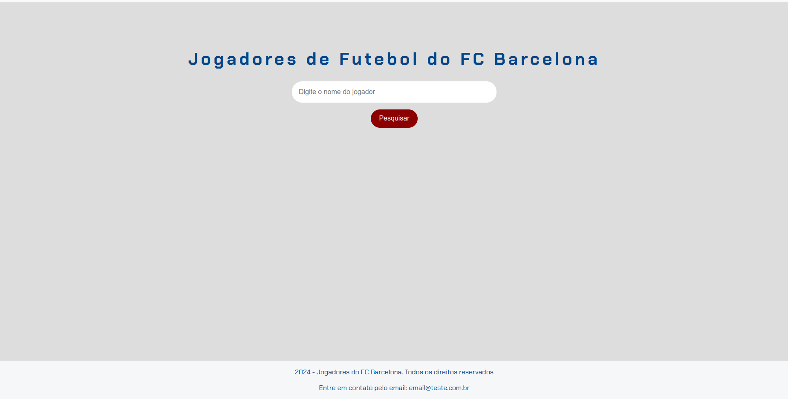
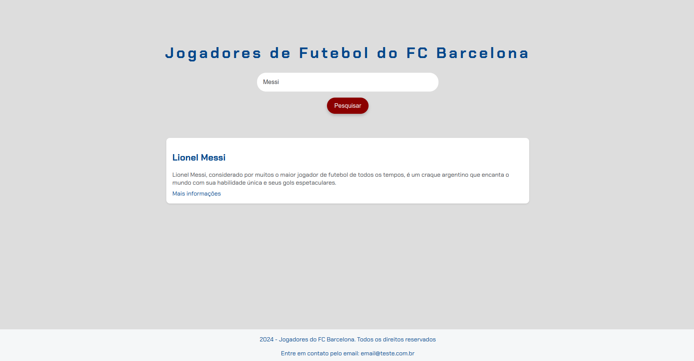

# Projeto: Jogadores do FC Barcelona

## Descrição
Este projeto tem como objetivo apresentar um catálogo simples de jogadores históricos do FC Barcelona. Atualmente, o site permite a busca por jogadores e exibe informações básicas sobre cada um. Foi desenvolvido na Imersão Dev com Google Gemini na Alura.

### Instrutores
* Rafaella Ballerini
* Guilherme Lima
* Luciano Martins

## Tecnologias Utilizadas
* **HTML:** Estruturação da página.
* **CSS:** Estilização da página.
* **JavaScript:** Interatividade e funcionalidades dinâmicas.

## Como Usar
1. **Clone o repositório:**
   ```bash
   git clone https://github.com/leonardomorita/imersao-alura-dev-gemini.git
   ```
2. Acessar no navegador Web o arquivo **index.html**.

3. Pesquisar o jogador e clicar no botão de pesquisar.

* <a href="https://github.com/leonardomorita/imersao-alura-dev-gemini/blob/main/js/dados.js" target="_blank">Base de dados</a>

## Autor
* Nome: Leonardo H. Morita
